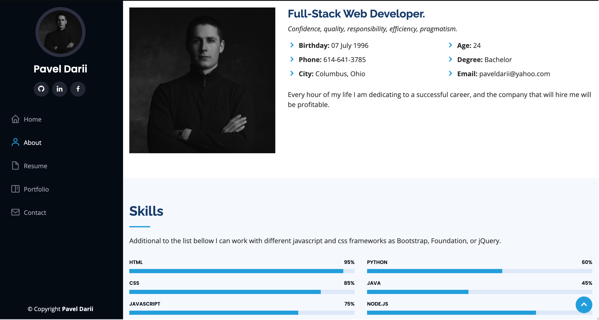

# iPortfolio

## Description

This site includes all the information that a potential employer will need to evaluate myself as a candidate for a Web Developer job.
The organization of the site corresponds to the links from the menu bar on the left side.
For example, it includes about section with general info about me, resume with a downloadable pdf file link, portfolio with photo and description of sites I already made, and contact section in the case someone wants to get in touch with me.

## Deployed link of the site

[Deployed link: https://paveldarii.github.io/iPortfolio/](https://paveldarii.github.io/iPortfolio/)
